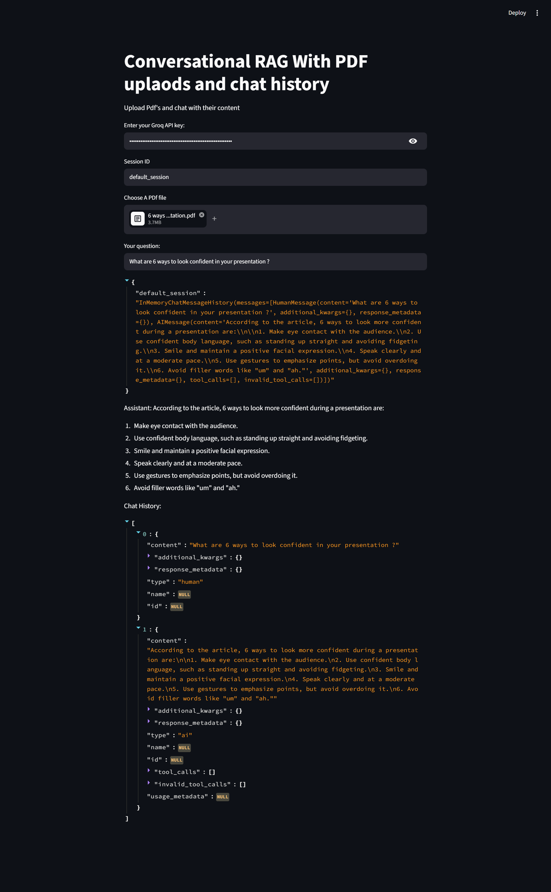

## Installation
1. Create virtual env -> python -m venv chatenv
2. Create requirements.txt -> Install all required libraries
3. Create .env -> Mention all your API keys (Langchain, Groq, Huggingface)
4. NOTE : In Langchain, create new project, inside that project -> Create API key -> Copy that in your .env file and then also mention the LANGCHAIN_PROJECT = "project_name"
5. Open Groq -> Create API key -> We use llama-3.1-8b-instant model for this. 

## Full Code Go Through
1. LLM Initialization & Layout Setup
Python
if api_key:
    llm=ChatGroq(groq_api_key=api_key,model_name="llama-3.1-8b-instant")

    ## chat interface
    session_id=st.text_input("Session ID",value="default_session")
if api_key:: A conditional block ensuring that the application only runs if the user has provided a valid Groq API key.

llm=ChatGroq(...): Initializes the chat model instance from LangChain's Groq integration, pinning it to the fast, open-weights llama-3.1-8b-instant model.

session_id=st.text_input(...): Renders a text input box in the Streamlit UI allowing users to define a unique session ID. This allows tracking or switching between different chat sessions (defaulting to "default_session").

2. Session State Management
Python
    ## statefully manage chat history
    if 'store' not in st.session_state:
        st.session_state.store={}
if 'store' not in st.session_state:: Checks if a dictionary named store exists in Streamlit’s memory.

st.session_state.store={}: Initializes an empty dictionary if it doesn't exist. This store acts as an in-memory database to map unique session_ids to their respective conversation histories, ensuring the app doesn't forget past messages on Streamlit re-renders.

3. PDF Uploading and Temporary Storage
Python
    uploaded_files=st.file_uploader("Choose A PDf file",type="pdf",accept_multiple_files=True)
    ## Process uploaded  PDF's
    if uploaded_files:
        documents=[]
        for uploaded_file in uploaded_files:
            temppdf=f"./temp.pdf"
            with open(temppdf,"wb") as file:
                file.write(uploaded_file.getvalue())
                file_name=uploaded_file.name

            loader=PyPDFLoader(temppdf)
            docs=loader.load()
            documents.extend(docs)
st.file_uploader(...): Creates a drag-and-drop file upload UI element configured strictly for PDFs, capable of handling multiple files simultaneously.

if uploaded_files:: Triggers document processing only when files are actively uploaded.

with open(temppdf,"wb") as file:: Standard LangChain loaders require local file paths. This block extracts the raw bytes of the uploaded file via .getvalue() and writes it to a temporary local file named temp.pdf.

PyPDFLoader(temppdf) & loader.load(): Parses the text out of the temporary PDF file.

documents.extend(docs): Aggregates all extracted document pages from multiple files into a single master list called documents.

4. Text Splitting, Vector Embedding, and Retrieval
Python
    # Split and create embeddings for the documents
        text_splitter = RecursiveCharacterTextSplitter(chunk_size=5000, chunk_overlap=500)
        splits = text_splitter.split_documents(documents)
        vectorstore = Chroma.from_documents(documents=splits, embedding=embeddings)
        retriever = vectorstore.as_retriever()    
RecursiveCharacterTextSplitter(...): Configures a text splitter that cuts large text down into manageable 5000 character chunks, with a 500 character overlapping window to prevent context loss between chunks.

splits = text_splitter.split_documents(...): Executes the splitting logic across all aggregated PDF texts.

Chroma.from_documents(...): Creates an in-memory vector database using ChromaDB. It processes the text chunks, calculates their vector representations using a pre-defined embeddings model, and indexes them.

retriever = vectorstore.as_retriever(): Converts the vector store into a retrieval object that can search and fetch relevant text fragments based on semantic similarity to a query.

5. History-Aware Retrieval (Query Contextualization)
Python
        contextualize_q_system_prompt=(
            "Given a chat history and the latest user question"
            "which might reference context in the chat history, "
            "formulate a standalone question which can be understood "
            "without the chat history. Do NOT answer the question, "
            "just reformulate it if needed and otherwise return it as is."
        )
        contextualize_q_prompt = ChatPromptTemplate.from_messages(
                [
                    ("system", contextualize_q_system_prompt),
                    MessagesPlaceholder("chat_history"),
                    ("human", "{input}"),
                ]
            )
        
        history_aware_retriever=create_history_aware_retriever(llm,retriever,contextualize_q_prompt)
contextualize_q_system_prompt: Instructions telling the LLM not to answer the user yet, but rather to rephrase their latest question if it references a previous message (e.g., if the user asks "What is it?" after asking about "Bitcoin", it rephrases it to "What is Bitcoin?").

ChatPromptTemplate.from_messages(...): Structures the prompt format containing system instructions, the conversational history placeholder, and the new user input.

create_history_aware_retriever(...): Wraps the basic vector retriever. It ensures that incoming chat history is factored in to adjust the user's query before searching the vector database for PDF data.

6. Question-Answering Chain Construction
Python
        # Answer question
        system_prompt = (
                "You are an assistant for question-answering tasks. "
                "Use the following pieces of retrieved context to answer "
                "the question. If you don't know the answer, say that you "
                "don't know. Use three sentences maximum and keep the "
                "answer concise."
                "\n\n"
                "{context}"
        )
        qa_prompt = ChatPromptTemplate.from_messages(
                [
                    ("system", system_prompt),
                    MessagesPlaceholder("chat_history"),
                    ("human", "{input}"),
                ]
            )
        
        question_answer_chain=create_stuff_documents_chain(llm,qa_prompt)
        rag_chain=create_retrieval_chain(history_aware_retriever,question_answer_chain)
system_prompt: Establishes constraints on the core LLM task—restricting answers strictly to retrieved PDF data ({context}), enforcing a 3-sentence maximum brevity constraint, and instructing a graceful "I don't know" fallback.

create_stuff_documents_chain(...): Sets up a document chain that feeds ("stuffs") all retrieved PDF text chunks alongside the prompt directly into the LLM.

create_retrieval_chain(...): Links the history-aware retriever pipeline with the document-stuffing QA chain, establishing the comprehensive master end-to-end RAG workflow.

7. Chat History Session Tracker
Python
        def get_session_history(session:str)->BaseChatMessageHistory:
            if session_id not in st.session_state.store:
                st.session_state.store[session_id]=ChatMessageHistory()
            return st.session_state.store[session_id]
        
        conversational_rag_chain=RunnableWithMessageHistory(
            rag_chain,get_session_history,
            input_messages_key="input",
            history_messages_key="chat_history",
            output_messages_key="answer"
        )
get_session_history(session): A helper function checking if the current session_id has an existing ChatMessageHistory() instance inside st.session_state.store. If missing, it builds one.

RunnableWithMessageHistory(...): Wraps the master rag_chain to dynamically track and inject conversation memory into it on-the-fly, mapping input and output parameters to their correct history keys automatically.

8. UI Execution & Response Rendering
Python
        user_input = st.text_input("Your question:")
        if user_input:
            session_history=get_session_history(session_id)
            response = conversational_rag_chain.invoke(
                {"input": user_input},
                config={
                    "configurable": {"session_id":session_id}
                },  # constructs a key "abc123" in `store`.
            )
            st.write(st.session_state.store)
            st.write("Assistant:", response['answer'])
            st.write("Chat History:", session_history.messages)
else:
    st.warning("Please enter the Groq API Key")
st.text_input("Your question:"): Displays an input field for the user's question.

conversational_rag_chain.invoke(...): Sends the question to the pipeline under the given configuration (session_id). This processes the question through the retrieval mechanism, checks history, fetches PDF context, runs the LLM, and logs the exchange to history.

st.write(...) elements: Displays diagnostic logs (the memory store dictionary and historical list of message components) alongside the final textual response['answer'] in the UI interface.

else: st.warning(...): Tells the user to submit an API key if the original initialization check failed.

## How to Run this Gen AI app on your system.
1. Download the project. 
2. Open in your VS code.
3. Make sure to create your virtual env -> by above steps.
4. pip install -r requirements.txt -> in your cmd to install all the libraries
5. Get you Langchain, Groq API keys -> and add in your .env file (You have to create externally)
6. Now run -> streamlit run app.py
7. In your local host, provide your Groq API key and click Enter.
8. Then upload your PDF document. 
9. Now you can ask your questions. 
10. After 1st question, you can also ask questions related to question 1 -> it will answer based on that. 

